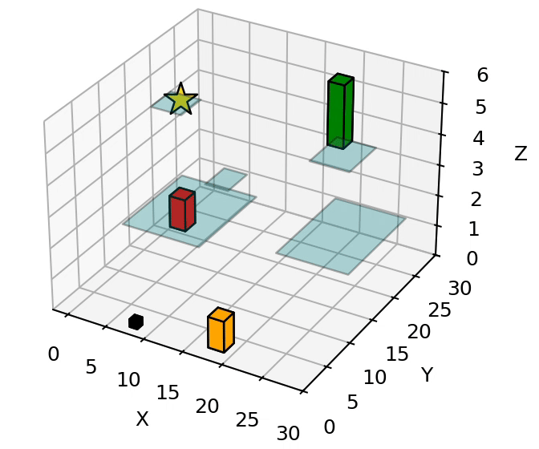

# BRiDGE

BRiDGE is a sampling-based planner for navigation among movable objects in 3D environments with disconnected support surfaces (e.g., gaps or height differences). Instead of treating unreachable goals as infeasible, the planner searches over sequences of pick-and-place actions that reposition movable blocks to *form new support surfaces*, effectively using them as bridges or steps that connect otherwise disconnected regions.

This repository contains the reference implementation used to generate planning results and visualizations.

---

## Code structure

- `BRiDGE.py`  
  Main entrypoint. Builds the environment, runs the planner, and visualizes the resulting plan.

- `bridging_planner.py`  
  Symbolic-plan utilities and abstractions used by the planner.

- `bfs_adapter.py`  
  Optional BFS-based biasing adapter for non-uniform sampling.

- `llm_adapter.py`  
  Optional LLM-based biasing adapter.  
  The prompt template is documented directly in this file.  
  (Import is commented out by default.)

- `proposal_2_visualizer_patched.py`  
  Visualization utilities used by `BRiDGE.py`.

---

## Requirements

The code relies on standard Python scientific and geometry libraries, including:
- `numpy`
- `scipy`
- `matplotlib`
- `networkx`
- `shapely`

(LLM-based biasing additionally requires the `openai` package and an API key.)

---

## Quick start

Run the main script: BRiDGE.py

This executes a built-in example (a horizon-6 scenario) and launches a 3D visualization of the resulting plan.

All experiment configuration is currently done inside `BRiDGE.py`.

---

## Key parameters and controls

The planner behavior and problem setup are controlled directly through variables defined in `BRiDGE.py`.

### Planning horizon

- Determines the maximum number of block placement actions considered.
- Increasing the horizon allows more complex bridging strategies but increases planning time.

### Sampling and iteration limits

- Parameters controlling the number of samples or node expansions directly affect runtime and solution quality.
- These can be adjusted to trade off planning speed versus solution robustness.

### Biasing strategy (optional)

- **Uniform sampling**: default behavior.
- **BFS-based biasing**: enabled by importing and using utilities from `bfs_adapter.py`.
- **LLM-based biasing**: implemented in `llm_adapter.py` and can be enabled by uncommenting the relevant import and calls in `BRiDGE.py`.

Biasing affects which actions are sampled first, but is not required for correctness.

### Environment definition

- Support surfaces (ground, tables, platforms) and movable blocks are explicitly defined in `BRiDGE.py`.
- Geometric parameters (positions, heights, extents) can be edited directly to construct new environments.

---

## Additional example setups

At the end of `BRiDGE.py`, several alternative environment configurations and experimental setups are commented out.

These can be uncommented and modified to:
- run the planner on different layouts,
- change the number of blocks,
- test different horizon values,
- explore planner behavior in simpler or more complex environments.

